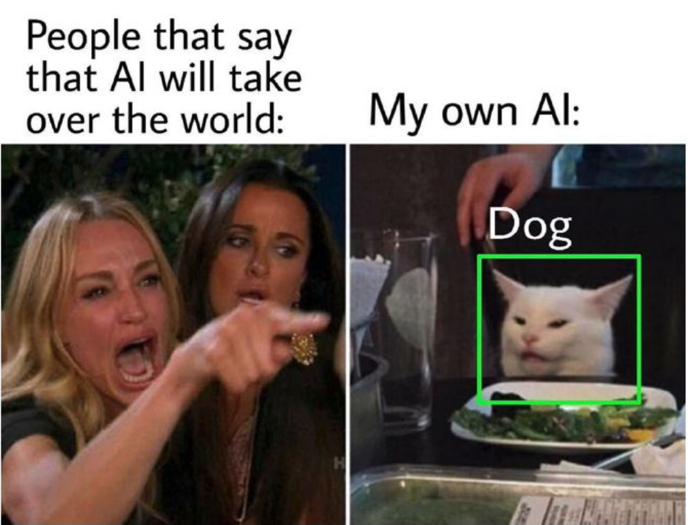

<div style="display:flex;justify-content:space-between">
    <div>
        <strong>
            Realise par :
        </strong>
        <br>&nbsp;&nbsp;&nbsp;&nbsp;Yasser Nabouzi
		<br>&nbsp;&nbsp;&nbsp;&nbsp;Hamza Mesrar
    </div>
    <div>
        <div style="text-align:right;margin-left:-45px;">
            2022-2023
        </div>
        <div>
            
        </div>
    </div>
</div>
<br>
<div style="position:relative;bottom:56px">
    <strong>
        Filliere :
    </strong>  IID2
</div>
<div style = "text-align:center">
    <strong>
        Encadre par : Pr.Ahmed Aghriche
    </strong>
</div>
<div style="font-size:35px;font-weight:bold;text-align:center;">
    THE BEAUTY OF COMPUTER VISION
</div>
<div style = "color:#66c2ff;text-align:center">
Object Detection
</div>

<br>
<center>

</center>

<!-- omit in toc -->
## > Would it work on my machine ?

Probably ?! idk as long as these following conditions are meet.
  * A Working computer
  * And hands
  * At least 1gb of free storage
  * python 3.9.1 (can be downloaded from [here](https://www.python.org/downloads/release/python-391/))
  * Have patient (it might take minutes, hours or maybe years)


<!-- omit in toc -->
### 1. Open your terminal in the project working directory :

Make sure you are operating in the project folder.

<!-- omit in toc -->
## 2. Create a Virtual Environment :

```bash
$ python3 -m venv env
```
This will create a Python self contained virtual environment that contains a specific version of Python and any associated libraries and dependencies.This allows for the creation of isolated environments for different projects or purposes, without affecting your overall system Python installation. elimenating any possibiltie for conflecting files and packages.

After running the previous command a folder by the name **env** should appear.


In order to not fall in any compatibilities issues it's highly recommended to update your pip and setuptools by running the following :

```bash
$ pip install pip -U
$ pip install setuptools -U
```

<!-- omit in toc -->
## 3. Activate your virtual environment :

To activate your virtual environment run the following commands that corresponds to your OS.
- **Windows** :
  - cmd
	```cmd
	$ env\Scripts\activate.bat
	```
  - powershell
	```powershell
	$ env\Scripts\activate.ps
	```
- Mac/Linux:
	```bash
	$ source ./env/bin/activate
	```
This will activate our virtual environment by adding an **env** next to our terminal command line.


To deactivate it run the following command

```bash
$ deactivate
```

<!-- omit in toc -->
## 4. Installing the required libraries :

Open-CV / easyocr / imutils / matplotlib

now we will install the required libraries needed for our project to run which python made easy using pip on a requirements.txt file.

```bash
$ pip install -r requirements.txt
```

> 💡 Tip of the day
> if you are working on your own vitual environement and you want to extract all the libraries you used in your isolated environment run the following.
> ``` pip freeze > requirements.txt```
> this should list all your packages and their versions in a requirements.txt

<!-- omit in toc -->
## 5. Congratulations new skill acquired 🥳

<div style="color:white;"><a style="text-decoration: none !important;color:white;">https://www.youtube.com/watch?v=dQw4w9WgXcQ</a></div>
Now you are a certified average python venv user.

<!-- omit in toc -->
## > Code Documentations 👨‍💻
This Project consists of two parts :

- [Cars Plates Detections 🚘](#cars-plates-detections-)
- [Video Detection 🤖](#video-detection-)

### Cars Plates Detections 🚘

In this first project you will find two files a Jupyter Notebook and a python main file, both are implementing what we have learned in our previous lessons regarding the **High-pass filter** and it's utilization in edge detection,by implementing the [Marr–Hildreth](https://en.wikipedia.org/wiki/Marr%E2%80%93Hildreth_algorithm) algorithm we can extract car plates from pictures.
The Mar-Hildreth code is done by **Afaf & Mouna**.

### Video Detection 🤖

This one is just straight forward, we try to use image processing and classification to detect objects from an already trained data.


